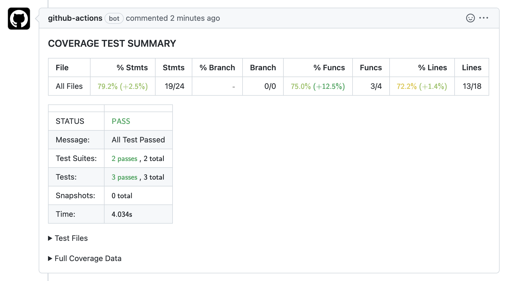

> __Note__
> The action uses [Jest](https://github.com/facebook/jest) to perform the test coverage.

# Jest Coverage Github Action

This GitHub action reports the code coverage with a report in the action and a comment if it is a Pull Request.




<p align="center">

- :page_facing_up: $\textcolor{#0F96CF}{\textbf{\textsf{Creates a code coverage report}}}$, with a **summary**, the **executed tests** and the **complete file coverage**.
- :mag_right: $\textcolor{#0F96CF}{\textbf{\textsf{Compare the pull request branches}}}$, specifying the coverage difference of the new branch.
- :x: $\textcolor{#F25D5A}{\textbf{\textsf{Reject the Pull Request}}}$ if:
  - The **minimum requirements demanded from the Jest configuration are not met** (default: error if the tests fail).
  - The **coverage difference between branches falls below a limit**.
- :speech_balloon: Add a $\textcolor{#0F96CF}{\textbf{\textsf{comment with the code coverage report}}}$.
- :speech_balloon: $\textcolor{#0F96CF}{\textbf{\textsf{Failed tests annotations}}}$.

----

## __TABLE OF CONTENTS__

  - [__1. CONFIGURATION__ <a name="config"></a>](#1-configuration-)
    - [__1. 1. MINIMAL CONFIGURATION__ <a name="config-minimal"></a>](#1-1-minimal-configuration-)
    - [__1. 2. ADVANCED CONFIGURATION__ <a name="config-advanced"></a>](#1-2-advanced-configuration-)
      - [___github-token___ $\textcolor{#F25D5A}{\textsf{\textit{Required}}}$              <a name="custom-github-token"></a>](#github-token-textcolorf25d5atextsftextitrequired--------------)
      - [___workdir___ <a name="custom-workdir"></a>](#workdir-)
      - [___jest-command___ <a name="custom-jest-command"></a>](#jest-command-)
      - [___jest-config-path___ <a name="custom-jest-config-path"></a>](#jest-config-path-)
      - [___jest-flags___ <a name="custom-jest-flags"></a>](#jest-flags-)
      - [___jest-output-path___ <a name="custom-jest-output-path"></a>](#jest-output-path-)
      - [___table-color-disabled___ <a name="custom-table-color-disabled"></a>](#table-color-disabled-)
      - [___table-display-mode___ <a name="custom-table-display-mode"></a>](#table-display-mode-)
      - [___threshold-between-branch___ <a name="custom-threshold-between-branch"></a>](#threshold-between-branch-)

----

## __1. CONFIGURATION__ <a name="config"></a>

### __1. 1. MINIMAL CONFIGURATION__ <a name="config-minimal"></a>

```yaml
name: 'workflow-name'
on: 
  pull_request:
    branches:
      - master
      - main
jobs:
  jest-coverage-reporter:
    runs-on: ubuntu-latest
    steps:
      - uses: actions/checkout@v3
      - uses: juanmartinez-facephi/jest-coverage-action@v1
        with:
          github-token: ${{ secrets.GITHUB_TOKEN }}
```

### __1. 2. ADVANCED CONFIGURATION__ <a name="config-advanced"></a>

###  ___github-token___ $\textcolor{#F25D5A}{\textsf{\textit{Required}}}$              <a name="custom-github-token"></a>
Token used to publish reports in the pull request.

```yaml
with:
  github-token: ${{ secrets.GITHUB_TOKEN }}
```

###  ___workdir___ <a name="custom-workdir"></a>
In order to execute the action in a custom directory, by default it will use the `rootdir` of the project. Config example:

```yaml
with:
  workdir: /app
```

###  ___jest-command___ <a name="custom-jest-command"></a>
The action will use jest to run the application tests, using the default command:
```bash
$ npx jest <jest-flags> --json --output=<jest-output-path>
```
You can change the command to any other command using the `jest-command` parameter, but the action needs a json file with the jest coverage to display the report, so it may be necessary to specify the new output filepath if the new command does not keep the same path as the default one.

```yaml
with:
  jest-command: npm run test:coverage
```

###  ___jest-config-path___ <a name="custom-jest-config-path"></a>
You can modify the jest configuration file used to run the tests, using the `jest-config-path` parameter, and specify different configurations for workflows that affect different branches running different tests depending on where the pull request is made.

```yaml
with:
  jest-config-path: jest.dev.config.js
```

###  ___jest-flags___ <a name="custom-jest-flags"></a>
The action also uses mandatory flags, such as the type and filename of the coverage test output, which cannot be modified unless you make a complete change to the test command using the `jest-command` parameter, and optional flags, `jest-flags`, by default it will not use any.

```yaml
with:
  jest-flags: --forceExit
```

###  ___jest-output-path___ <a name="custom-jest-output-path"></a>
The `jest-output-path` parameter allows you to modify the name of the output file, which by default will take the value `jest.output.coverage.json`. The filename will be used both **to generate the json report** and **to read the file afterwards**. If the command is changed it will still be used to find the file with the report.

```yaml
with:
  jest-output-path: output/coverage.json
```

###  ___table-color-disabled___ <a name="custom-table-color-disabled"></a>
You can disable the color of the tables using the following parameter, which by default will take the value of `true`.

```yaml
with:
  table-color-disabled: false
```

###  ___table-display-mode___ <a name="custom-table-display-mode"></a>
The report tables have the following fields: `% Stmts`, `Stmts`, `% Branch`, `Branch`, `% Funcs`, `Funcs`, `% Lines`, `Lines`. In the fields with percentage, the percentage of file coverage will be expressed (xx.x%), while in the others, the number of elements covered vs. the total number of elements (xx/xx) will be shown.ç

With the `table-display-mode` parameter you can configure the amount of information in the tables, depending on what you need:
-`ALL` shows all fields.
-`SIMPLE` shows only the percentage fields.
-`STATEMENTS` shows only the `% Stmts` field.

```yaml
with:
  table-display-mode: SIMPLE
```

###  ___threshold-between-branch___ <a name="custom-threshold-between-branch"></a>
To facilitate the maintenance of the projects, it was interesting to add a new threshold based on the difference in coverage between branches of the pull request. To avoid a strong decrease in the coverage of the project.

With the `threshold-between-branch` parameter you can set a minimum, for example '-20', it means that the coverage in the pull request cannot drop more than 20%, if the base branch has a coverage of 80% and the branch to be merged has 59%, it will give an error because the coverage has dropped by 21%.

By default the value is `-100`, which means that it is never fulfilled, so it is "disabled".

```yaml
with:
  threshold-between-branch: -10
```


